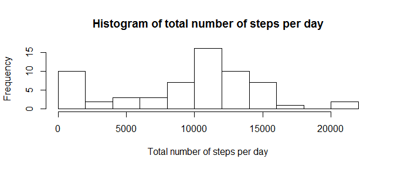
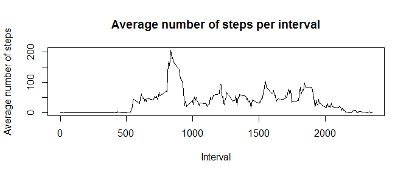
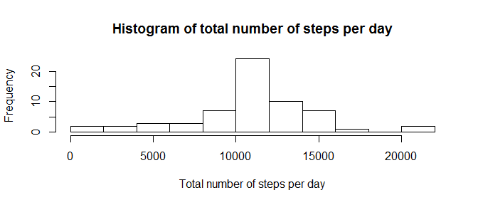
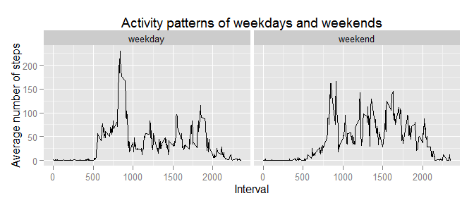

# Reproducible Research: Peer Assessment 1

### Loading and preprocessing the data

```
library(dplyr)

# Load the data
activity <- read.csv("activity\\activity.csv", stringsAsFactors = FALSE)

# Process/transform the data
activity$date <- as.Date(activity$date)
activity_tb <- tbl_df(activity)
```

---

### What is mean total number of steps taken per day?


```r
# Calculate the total number of steps taken per day
activity_date <- group_by(activity_tb,date)
total_steps_per_day <- summarise(activity_date, steps = sum(steps, na.rm = TRUE))

# Create histogram of the total number of steps taken each day
with(total_steps_per_day, hist(steps, breaks = 10, xlab = "Total number of steps per day", main = "Histogram of total number of steps per day"))
```



```r
# Calculate mean and median of total number of steps per day
summary(total_steps_per_day$steps)
```

```
##    Min. 1st Qu.  Median    Mean 3rd Qu.    Max. 
##       0    6778   10400    9354   12810   21190
```

---

### What is the average daily activity pattern?


```r
# Create time series plot of the 5-minute interval and average number of steps taken, averaged across all days
activity_interval <- group_by(activity_tb, interval)
average_steps_per_int <- summarise(activity_interval, steps = mean(steps, na.rm = TRUE))
with(average_steps_per_int, plot(interval, steps, type = "l", xlab = "Interval", ylab = "Average number of steps", main = "Average number of steps per interval"))
```



```r
## Which 5-minute interval, on average across all the days in the dataset, contains the maximum number of steps
max_average_steps <- max(average_steps_per_int$steps, na.rm = TRUE)
filter(average_steps_per_int, steps == max_average_steps)
```

```
## Source: local data frame [1 x 2]
## 
##   interval    steps
##      (int)    (dbl)
## 1      835 206.1698
```

---

### Imputing missing values


```r
# Calculate the total number o fmissing values in the dataset
sum(is.na(activity_tb$steps))
```

```
## [1] 2304
```

```r
# Create strategy: replacing missing values by rounded mean of interval

# Create new dataset that is equal to the origina ldataset but with the missing data filled in
activity_na <- activity_tb

for (i in 1:length(activity_na$steps)) { 
    if (is.na(activity_na$steps[i])) {
        intv <- activity_na$interval[i]
        avg <- filter(average_steps_per_int, interval == intv)[1,2]
        
        activity_na$steps[i] <- as.integer(avg)
    }
}

# Create a histogram of the total number of steps taken each day and calculate and report the mean and median total number of steps taken per day.
activity_na_date <- group_by(activity_na,date)

total_steps_na_per_day <- summarise(activity_na_date, steps = sum(steps))

with(total_steps_na_per_day, hist(steps, breaks = 10, xlab = "Total number of steps per day", main = "Histogram of total number of steps per day"))
```



```r
# Calculate mean and median
summary(total_steps_na_per_day$steps)
```

```
##    Min. 1st Qu.  Median    Mean 3rd Qu.    Max. 
##      41    9819   10640   10750   12810   21190
```

```r
# Difference mean
summary(total_steps_per_day$steps)[4] - summary(total_steps_na_per_day$steps)[4]
```

```
##  Mean 
## -1396
```

```r
# Difference median
summary(total_steps_per_day$steps)[3] - summary(total_steps_na_per_day$steps)[3]
```

```
## Median 
##   -240
```

---

### Are there differences in activity patterns between weekdays and weekends?


```r
# Create a new factor variable in the dataset with two levels - "weekday" and "weekday" indicating whether a given date is a weekday or weekend day 
activity_weekdays <- mutate(activity_na, weekday = factor(weekdays(date)))

for (i in 1:length(activity_weekdays$steps)) {
    if (as.numeric(activity_weekdays$weekday[i]) < 6) {
        activity_weekdays$week_f[i] <- "weekday"
    } else {
        activity_weekdays$week_f[i] <- "weekend"
    }
}

activity_weekdays$week_f <- factor(activity_weekdays$week_f) 

# Create a panel_plot containing a time series plot of the 5-minute interval and the average number of steps taken, averaged across all weekday days or weekend days.
activity_weekdays_grouped <- group_by(activity_weekdays, interval, week_f)
average_steps_weekdays_per_int <- summarise(activity_weekdays_grouped, steps = mean(steps))

ggplot(average_steps_weekdays_per_int, aes(interval, steps)) +
    geom_line() + 
    facet_grid( .~week_f) + 
    xlab("Interval") + 
    ylab("Average number of steps") + 
    ggtitle("Activity patterns of weekdays and weekends")
```


